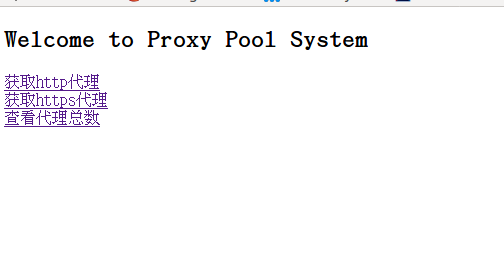
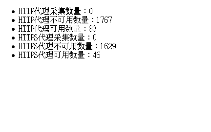

# CrawlFreeProxy
Free proxy IP for common work (made by python3).

本项目原本是自用的免费代理池，后来用过项目[Germey/ProxyPool](https://github.com/Germey/ProxyPool)后，参考Germey的思路，给项目做了简单的web端和api。  
项目特性：
1. 支持HTTP和HTTPS：分别采集和验证http和https的代理
2. 同步更新：根据网站更新频率进行增量爬取
3. 提供api

### 1. 依赖
- 安装redis server  
    way1： `sudo apt-get install redis-server`  
    way2: [安装redis参考链接](https://www.digitalocean.com/community/tutorials/how-to-install-and-configure-redis-on-ubuntu-16-04)
- pypi依赖包
    ```
    pip3 install requests bs4 Flask lxml redis
    ```

### 2. 使用
```
python web_app.py
```
默认开放公网访问

如果需要修改ip和端口，编辑 `web_app.py` 最后一行，修改host和port的值即可
```
app.run(host="0.0.0.0", port=7865)
```

### 3. api
访问主页
```
http://192.168.70.40:7865/
```

#### 3.1 查看ip总量
```
http://192.168.70.40:7865/count
```

#### 3.2 获取http代理
```
http://192.168.70.40:7865/random_http
```
返回 `ip:port` 字符串
#### 3.3 获取https代理
```
http://192.168.70.40:7865/random_https
```
返回 `ip:port` 字符串